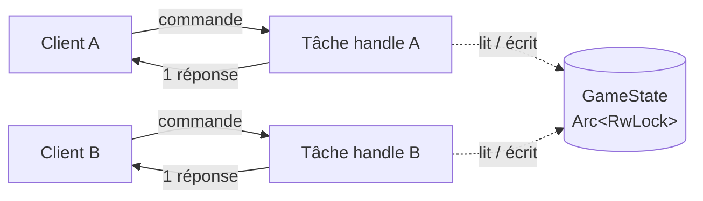
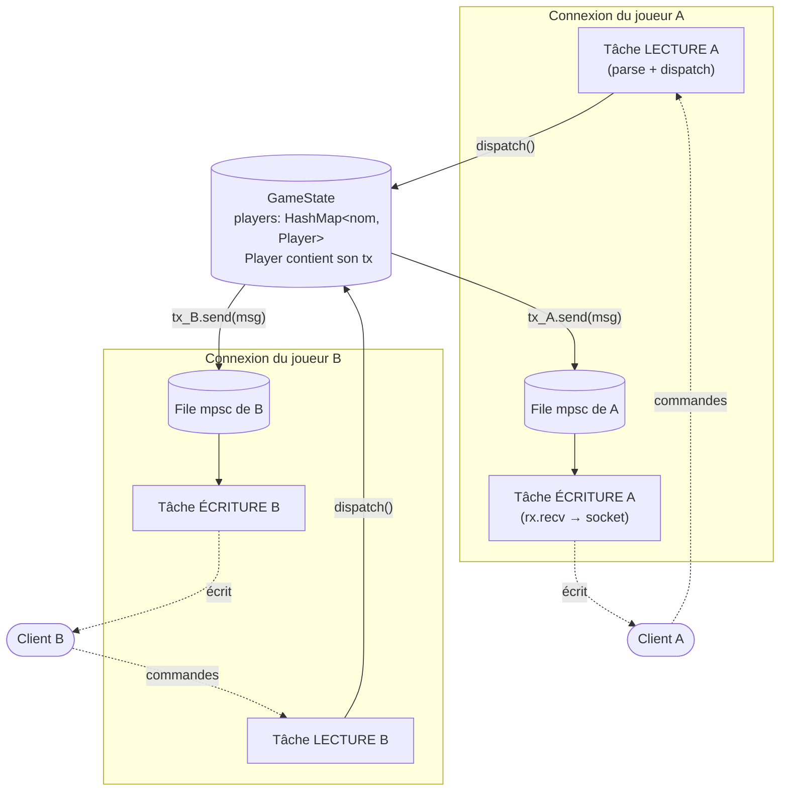
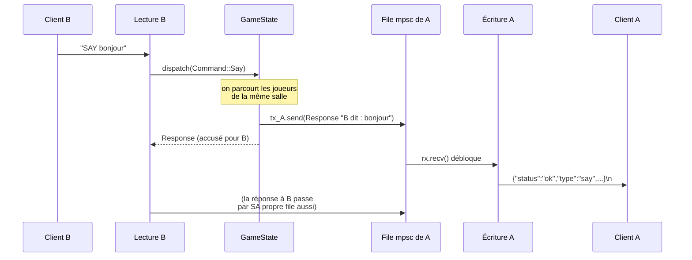
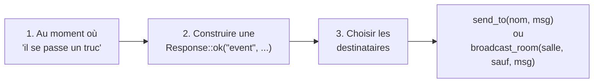

# Implémenter un système d'events proprement

> Guide pas à pas, écrit pour quelqu'un qui débute. Adapté **à ton code actuel**
> (`server/src/...`). À la fin tu auras un serveur capable d'envoyer des
> messages à un joueur **sans qu'il ait rien demandé** (ex : « B vient
> d'entrer dans la salle »).

---

## 1. Le problème

Aujourd'hui ton serveur fonctionne en **question → réponse**. Le client
envoie une commande, il reçoit **une** réponse, point.



Regarde [handle.rs](../server/src/network/handle.rs) : la variable `writer`
(par où on écrit vers le client) est **enfermée dans la boucle de cette
connexion**. La tâche du joueur B n'a aucun moyen d'écrire dans le `writer`
du joueur A.

> **Conclusion :** tant que le `writer` est privé à sa boucle, aucun event
> « venu d'ailleurs » n'est possible. Il faut une **boîte aux lettres
> partagée** par joueur.

---

## 2. L'idée, en une phrase

> On donne à **chaque joueur une file d'attente de messages** (un *channel*).
> N'importe quel bout de code qui a accès au `GameState` peut déposer un
> message dans la file d'un joueur ; une petite tâche dédiée vide cette file
> vers la socket.

C'est tout. Le reste n'est que de la plomberie.

---

## 3. Les 3 concepts à connaître

| Concept | C'est quoi | Analogie |
|---|---|---|
| `tokio::sync::mpsc` | Un *channel* : un tuyau avec un côté qui **envoie** (`tx`) et un côté qui **reçoit** (`rx`). « mpsc » = plusieurs émetteurs, un seul récepteur. | Une **boîte aux lettres**. Plein de gens peuvent y glisser une lettre (`tx`), une seule personne la relève (`rx`). |
| Tâche d'écriture | Une tâche `tokio::spawn` qui ne fait qu'une chose : `rx.recv()` puis écrire sur la socket, en boucle. | Le **facteur** dédié à un client : il attend qu'il y ait du courrier dans la file et le livre. |
| `Arc<RwLock<GameState>>` (déjà chez toi) | L'état partagé entre toutes les connexions. On va y stocker le `tx` (l'entrée de la boîte) de chaque joueur. | Le **registre central** : on y trouve l'adresse (la boîte aux lettres) de chaque joueur connecté. |

Le point clé : on **sépare lire et écrire**. Aujourd'hui une seule boucle
fait les deux. Demain : une tâche lit les commandes, une autre écrit les
messages — et n'importe qui peut alimenter celle qui écrit.

---

## 4. L'architecture cible



Différence avec aujourd'hui :

- Chaque connexion = **2 tâches** (lecture / écriture) + **1 file**.
- Le `Player` stocké dans le `GameState` garde une copie de **son `tx`**.
- Donc la tâche lecture de B peut, via le `GameState`, déposer un message
  dans la file de A. **C'est ça, le système d'events.**

---

## 5. Le trajet d'un event de bout en bout

Exemple : B tape `SAY bonjour` dans une salle où se trouve aussi A.



Remarque importante : **même la réponse directe à B** passe désormais par sa
file à lui. Comme ça il n'y a **qu'un seul endroit** qui écrit sur chaque
socket (la tâche écriture). Pas de course entre « ma réponse » et « un event
reçu en même temps ».

---

## 6. Implémentation pas à pas

On garde ton format de fil : on continue à envoyer des lignes JSON
`Response`. Un « event » n'est rien d'autre qu'une `Response` poussée
spontanément. **Pas besoin d'inventer un nouveau format.**

### Étape 0 — Rendre `Response` clonable

Pour envoyer le même message à plusieurs joueurs d'une salle, il faut pouvoir
le copier.

`server/src/protocol/response.rs`

```rust
// avant
#[derive(Debug, Serialize)]
// après
#[derive(Debug, Clone, Serialize)]
pub enum Response { /* inchangé */ }
```

### Étape 1 — Le `Player` porte sa boîte aux lettres

`server/src/state/player.rs`

```rust
use tokio::sync::mpsc::UnboundedSender;
use crate::protocol::response::Response;

pub struct Player {
    pub name: String,
    pub addr: String,
    pub room: String,
    /// Entrée de la file de ce joueur : pour lui pousser un message,
    /// on fait `player.tx.send(response)`.
    pub tx: UnboundedSender<Response>,
}
```

### Étape 2 — Des helpers d'envoi sur le `GameState`

C'est le cœur du système d'events : des fonctions « envoie à X »,
« envoie à toute la salle ».

`server/src/state/game.rs`

```rust
use std::collections::HashMap;
use crate::protocol::response::Response;

pub struct GameState {
    pub players: HashMap<String, super::player::Player>,
}

impl GameState {
    pub fn new() -> Self {
        GameState { players: HashMap::new() }
    }

    /// Pousse un message à UN joueur (par son nom).
    /// Le `let _ =` ignore l'erreur si le joueur s'est déjà déconnecté.
    pub fn send_to(&self, name: &str, msg: Response) {
        if let Some(p) = self.players.get(name) {
            let _ = p.tx.send(msg);
        }
    }

    /// Pousse un message à tous les joueurs d'une salle,
    /// en sautant éventuellement quelqu'un (souvent celui qui a agi).
    pub fn broadcast_room(&self, room: &str, except: Option<&str>, msg: Response) {
        for p in self.players.values() {
            if p.room == room && Some(p.name.as_str()) != except {
                let _ = p.tx.send(msg.clone());
            }
        }
    }
}
```

> Envoyer dans un channel `unbounded` est **non bloquant** : on peut le faire
> en tenant le verrou du `GameState` sans risque de blocage.

### Étape 3 — Découper `handle` : 1 file + 1 tâche d'écriture

C'est le plus gros changement, mais la logique reste simple : on crée la
file, on lance le « facteur », et la boucle de lecture **n'écrit plus
directement** — elle dépose dans la file.

`server/src/network/handle.rs`

```rust
use std::sync::Arc;
use tokio::io::{AsyncBufReadExt, AsyncWriteExt, BufReader};
use tokio::net::TcpStream;
use tokio::sync::{mpsc, RwLock};

use crate::protocol::command::Command;
use crate::protocol::response::Response;
use crate::state::game::GameState;
use tracing::{debug, info};

pub async fn handle(socket: TcpStream, addr: String, state: Arc<RwLock<GameState>>) {
    let (reader, mut writer) = socket.into_split();
    let mut lines = BufReader::new(reader).lines();

    // 1. La boîte aux lettres de CETTE connexion.
    let (tx, mut rx) = mpsc::unbounded_channel::<Response>();

    // 2. Le facteur : il ne fait QUE vider la file vers la socket.
    let writer_task = tokio::spawn(async move {
        while let Some(resp) = rx.recv().await {
            if writer.write_all(resp.to_line().as_bytes()).await.is_err() {
                break; // client parti, on arrête le facteur
            }
        }
    });

    // 3. La boucle de lecture : parse → dispatch → on DÉPOSE la réponse
    //    dans notre propre file (au lieu d'écrire direct sur la socket).
    while let Ok(Some(line)) = lines.next_line().await {
        let line = line.trim().to_string();
        if line.is_empty() {
            continue;
        }
        debug!("[{}] << {}", addr, line);

        let response = match Command::parse(&line) {
            // on passe `&tx` pour que CONNECT puisse le ranger dans le Player
            Ok(cmd) => super::dispatch::dispatch(cmd, &addr, &tx, Arc::clone(&state)).await,
            Err(e) => e,
        };

        if tx.send(response).is_err() {
            break; // le facteur est mort → on arrête de lire
        }
    }

    // 4. Nettoyage. On retire le joueur : ça supprime le `tx` rangé dans
    //    le GameState. Le `tx` local est lâché à la fin de la fonction.
    //    Quand TOUS les tx sont lâchés, `rx.recv()` renvoie None et le
    //    facteur s'arrête tout seul. Propre, pas besoin d'abort().
    info!("Connection closed: {}", addr);
    {
        let mut state = state.write().await;
        state.players.retain(|_, v| v.addr != addr);
    }
    let _ = writer_task.await;
}
```

### Étape 4 — `dispatch` reçoit le `tx` et émet des events

Deux choses :
1. `CONNECT` range une **copie du `tx`** dans le `Player` (sinon personne ne
   pourra jamais lui écrire) et prévient la salle.
2. On ajoute une commande `SAY` qui **diffuse** à la salle — le premier vrai
   event.

`server/src/network/dispatch.rs`

```rust
use std::sync::Arc;
use tokio::sync::{mpsc, RwLock};
use serde_json::json;

use crate::protocol::command::Command;
use crate::protocol::response::Response;
use crate::state::game::GameState;
use crate::state::player::Player;
use tracing::info;

pub async fn dispatch(
    cmd: Command,
    addr: &str,
    tx: &mpsc::UnboundedSender<Response>, // <-- nouveau
    state: Arc<RwLock<GameState>>,
) -> Response {
    match cmd {
        Command::Connect { name } => {
            let mut state = state.write().await;
            if state.players.contains_key(&name) {
                Response::error(409, "Name already taken")
            } else {
                state.players.insert(name.clone(), Player {
                    name: name.clone(),
                    addr: addr.to_string(),
                    room: "start".to_string(),
                    tx: tx.clone(), // <-- on range SA boîte aux lettres
                });

                // EVENT : on prévient les autres de la salle "start"
                state.broadcast_room(
                    "start",
                    Some(&name), // sauf le nouveau venu lui-même
                    Response::ok("event", json!({
                        "event": "player_joined",
                        "name": name,
                    })),
                );

                info!("Player '{}' joined", name);
                Response::ok("connect", json!({ "name": name }))
            }
        }

        // EXEMPLE d'event déclenché par une commande
        Command::Say { text } => {
            let state = state.read().await;
            // de quelle salle parle l'émetteur ?
            let speaker = state.players.values().find(|p| p.addr == addr);
            match speaker {
                Some(p) => {
                    let room = p.room.clone();
                    let from = p.name.clone();
                    state.broadcast_room(
                        &room,
                        Some(&from), // les autres reçoivent l'event...
                        Response::ok("event", json!({
                            "event": "said",
                            "from": from,
                            "text": text,
                        })),
                    );
                    // ...et l'émetteur reçoit un accusé normal
                    Response::ok("say", json!({ "text": text }))
                }
                None => Response::error(403, "Connect first"),
            }
        }

        Command::Who => {
            let state = state.read().await;
            let names: Vec<&String> = state.players.keys().collect();
            Response::ok("who", json!({ "players": names }))
        }

        Command::Look => Response::ok("look", json!({
            "description": "You are in a dark room.",
            "exits": ["north"],
        })),

        Command::Group { action: _ } => Response::ok("createGroup", json!({
            "description": "Try to create group.",
        })),

        Command::Unknown(raw) => Response::error(404, format!("Unknown command: {}", raw)),
    }
}
```

### Étape 5 — Déclarer la commande `SAY`

`server/src/protocol/command.rs`

```rust
pub enum Command {
    Connect { name: String },
    Who,
    Look,
    Group { action: String },
    Say { text: String }, // <-- nouveau
    Unknown(String),
}

// dans parse(), dans le match verb.as_str() :
"SAY" => {
    if rest.is_empty() {
        Err(Response::error(400, "SAY requires a message"))
    } else {
        Ok(Command::Say { text: rest.to_string() })
    }
}
```

C'est fini. Tu peux tester avec deux `nc 127.0.0.1 4000` côte à côte :
connecte les deux, fais `SAY bonjour` dans l'un → l'autre reçoit l'event
sans avoir rien tapé. 🎉

---

## 7. Recette : ajouter un nouvel event plus tard

Tu n'as plus jamais à retoucher la plomberie (Étapes 0 à 3). Pour tout
nouvel event :



Exemples :
- Joueur qui quitte → dans le nettoyage de `handle`, avant le `retain`,
  faire un `broadcast_room` `player_left`.
- Message privé → `state.send_to(&cible, Response::ok("event", json!({...})))`.
- Déplacement entre salles → `broadcast_room` sur l'ancienne ET la nouvelle.

---

## 8. Pièges & améliorations possibles

| Sujet | À savoir |
|---|---|
| **`unbounded_channel`** | Simple, suffisant ici. Mais si un client est très lent, sa file peut grossir indéfiniment en mémoire. Plus tard : passer à `mpsc::channel(capacité)` (file bornée) et décider quoi faire quand elle est pleine (jeter le message ? déconnecter ?). |
| **Trouver un joueur par `addr`** | Dans `Say` on fait un `find` sur l'adresse, c'est O(n). Acceptable au début. Mieux : faire porter au reader le `name` du joueur connecté pour l'avoir directement. |
| **Tenir le `RwLock` pendant le broadcast** | OK car `tx.send` est non bloquant. Évite quand même d'y faire des choses lentes (I/O, `await`) en tenant le verrou. |
| **Une seule tâche écrit la socket** | C'est volontaire et important : ça supprime toute course entre « ma réponse » et « un event reçu pile en même temps ». Ne réécris jamais directement dans `writer` ailleurs. |
| **Enum `Event` dédié ?** | Ici on réutilise `Response` (plus simple, un seul format sur le fil). Si un jour la logique « quoi notifier » devient riche, tu pourras introduire un `enum Event { PlayerJoined, Said, ... }` que le `GameState` transforme en `Response` au moment de l'envoi. Pas nécessaire pour démarrer. |

---

## Récap des fichiers touchés

| Fichier | Changement |
|---|---|
| [response.rs](../server/src/protocol/response.rs) | ajouter `Clone` au derive |
| [player.rs](../server/src/state/player.rs) | champ `tx: UnboundedSender<Response>` |
| [game.rs](../server/src/state/game.rs) | helpers `send_to` / `broadcast_room` |
| [handle.rs](../server/src/network/handle.rs) | file mpsc + tâche d'écriture, réponses via `tx` |
| [dispatch.rs](../server/src/network/dispatch.rs) | reçoit `&tx`, `CONNECT` range le `tx`, émet des events |
| [command.rs](../server/src/protocol/command.rs) | commande `SAY` (exemple d'event) |
</content>
</invoke>
